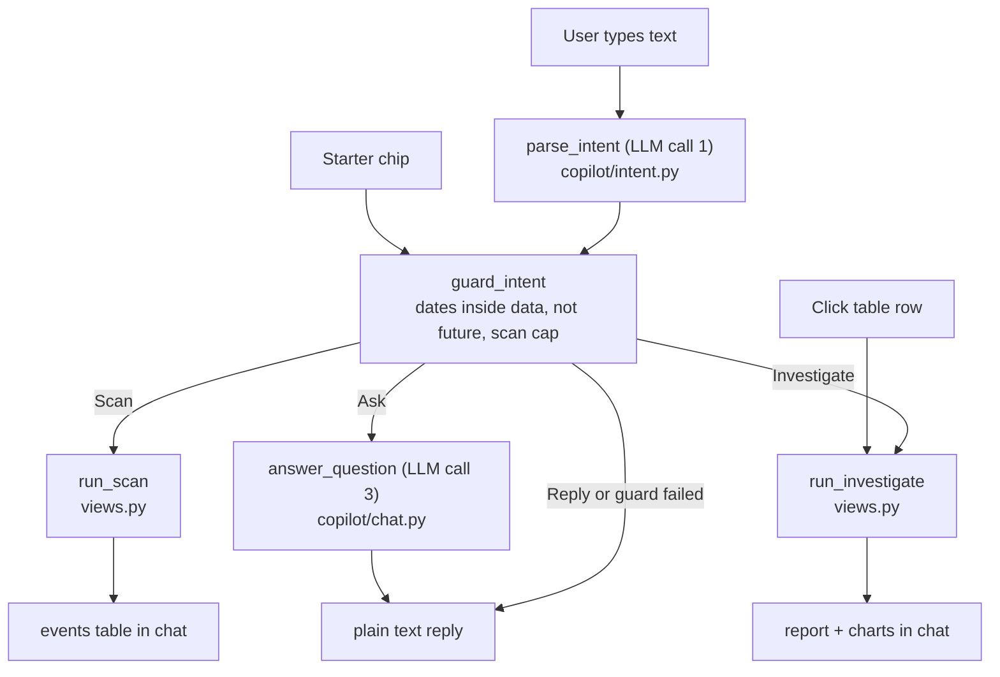
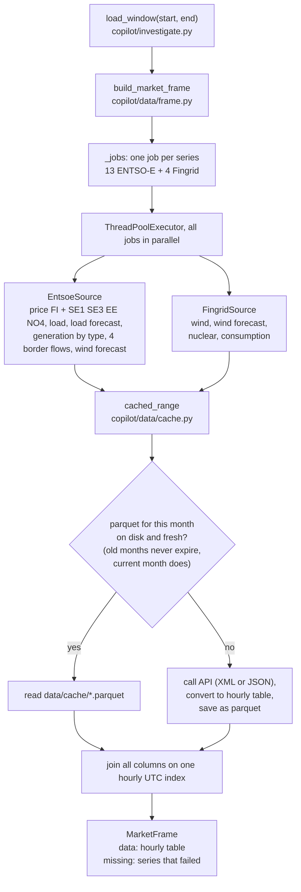
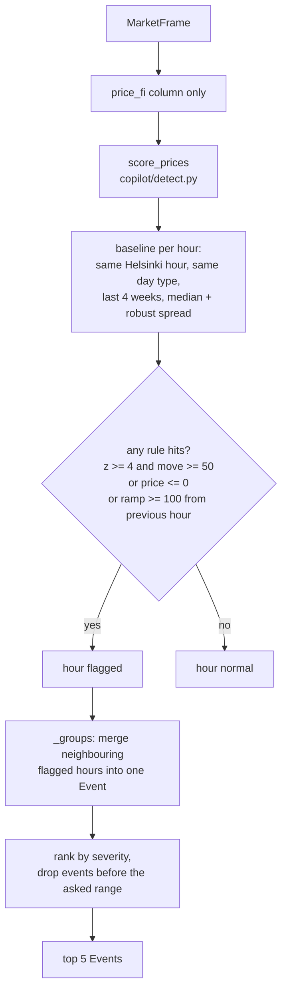
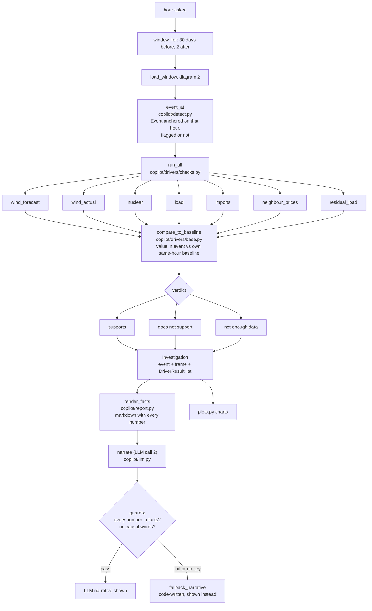

# How a question flows through the code

Four diagrams: the chat loop, fetching data, scanning a range, investigating one hour.
Function names are the real ones, so you can grep them.

## 1. Chat loop (`app.py`, `views.py`)

Starter chips and table-row clicks skip the LLM and go straight to `handle_intent`.

## 2. Fetching data (`copilot/data/`)

Every fetch, whether for a scan or an investigation, goes through `build_market_frame`.

A job that fails after 3 tries is not an error. Its column is left out and its name goes into
`missing`, so the driver that needs it says "not enough data".

## 3. Scan a range (`scan` in `copilot/investigate.py`)

## 4. Investigate one hour (`investigate_at` in `copilot/investigate.py`)

`supports` means the series moved in the direction that pushes the price the way it went, by a
clear margin over its own normal spread. Details of the rules and thresholds:
[DETECTION.md](DETECTION.md).
